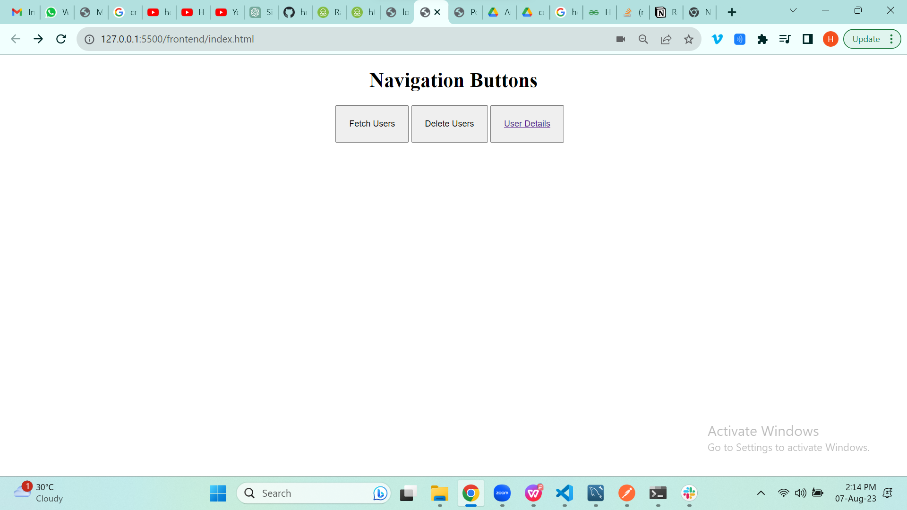

# User Detail System

## Introduction
In this project, I have built a website using Node.js and an SQL database. Page 1 has 3 buttons: "Fetch Users" gets lots of user info from a website,"Delete Users" removes all info, and "User Details" shows info neatly in the user detail page in table format. Clicking Fetch Users gets 50 or 100 records. Clicking User Details shows data in a table, and you can change pages with filters and pages to make it easy to find info about users.


## Video Walkthrough of the project
https://vimeo.com/852264410/f6092fe64b

## Features
- Fetches random users
- Sorting with DOB
- Searching With Name


## Installation & Getting started
```bash
npm install 
npm run server
```

## Usage
Username and Password needs to be change accordingly to make it work, as i am using the local mysql workbench.




## APIs Used
https://randomuser.me/

## API Endpoints
GET /get/:page - retrieve 10 users at a time from the database, pagination has been implemented.
POST /create - fetches users from external api and inserts them to our local database.
DELETE /delete - deletes all the user data at once from our local database.

## Technology Stack
- Node.js
- Express.js
- MongoDB
- mysql2
- sequelize
- nodemon